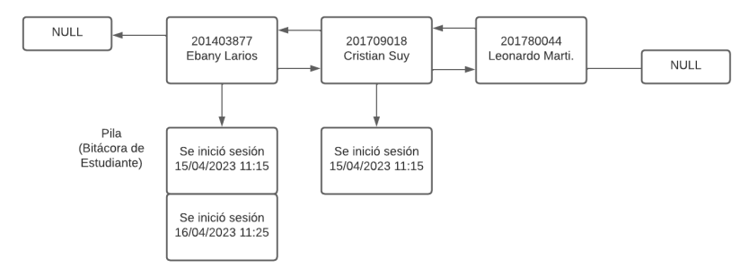
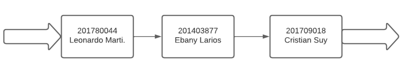
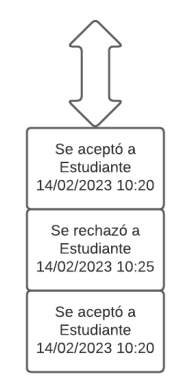

Diego Andrés Huite Alvarez

202003585

# Manual técnico

## Descripción:

La fase 1 de este proyecto consiste en crear una pequeña aplicación en donde se puedan crear usuarios de alumnos, almacenar su información como su no. de carnet, su nombre, etc.  Así como también el almacenar las aceptaciones y rechazos  que realice el administrador de alumnos que deseen crear su usuario en el sistema. 

El programa es capaz de generar reportes en graphviz como las imágenes que verá en la explicación de las estructuras donde se almacenará la información.

El almacenamiento de toda esta información será contenido por las siguientes estructuras de datos:

- Lista doblemente enlazada que contenga pilas: Se encargará de guardar la información de los alumnos registrados en el sistema incluyendo sus inicios de sesión.
  
  

- Cola: Se encargará de llevar un registro de los alumnos que están a la espera de ser aceptados o rechazados por el administrador.
  
  

- Pila: Se encargará de guardar las acciones que realice el adminsitrador con los alumnos.



Esta fase del proyecto está pensada para seguir siendo utilizada, es por eso que tiene la capacidad de generar un reporte .json sobre los alumnos que estaban registrados en el sistema en ese momento


La información de los alumnos puede ser extraida de un archivo .csv en el menú de administrador con la siguiente estructura

```csv
carnet, nombre, contraseña
20200358,Diego Huite,123
202003887,Alfonso Juarez,KM-123
201908745,Karla Hernandez,KKarH_
202151485,Elisa Marquez,elis@
201801478,Josue Perez,PerezK48
```

##### Ejemplo del archivo de salida .json

```json5
{
 "Alumnos": [
  {
   "Id": 202003887,
   "Name": " Alfonso Juarez",
   "Password": "KM-123",
   "Carpeta_Raiz": "/"
  },
  {
   "Id": 202003585,
   "Name": " Diego Huite",
   "Password": "123",
   "Carpeta_Raiz": "/"
  },
  {
   "Id": 201908745,
   "Name": "Karla Hernandez",
   "Password": "KKarH_",
   "Carpeta_Raiz": "/"
  },
  {
   "Id": 202151485,
   "Name": "Elisa Marquez",
   "Password": "elis@",
   "Carpeta_Raiz": "/"
  },
  {
   "Id": 201801478,
   "Name": "Josue Perez",
   "Password": "PerezK48",
   "Carpeta_Raiz": "/"
  }
 ]
}
```

#### Lenguaje usado para desarrollar esta fase

- Lenguage de programación _go_

#### Requerimientos para ejecutar la fase

- Go (versión 1.20)

- Teclado

- 3gb de memoria RAM

- Graphviz

- Distro de Linux
