# Manual de usuario

Bienvenido al manual de usuario de la página: https://dgo45921.github.io/EDD_1S2023_PY_202003585/

Este sitio web le permite almacenar archivos y crear carpetas en un sitio web.

### Inicio de sesión

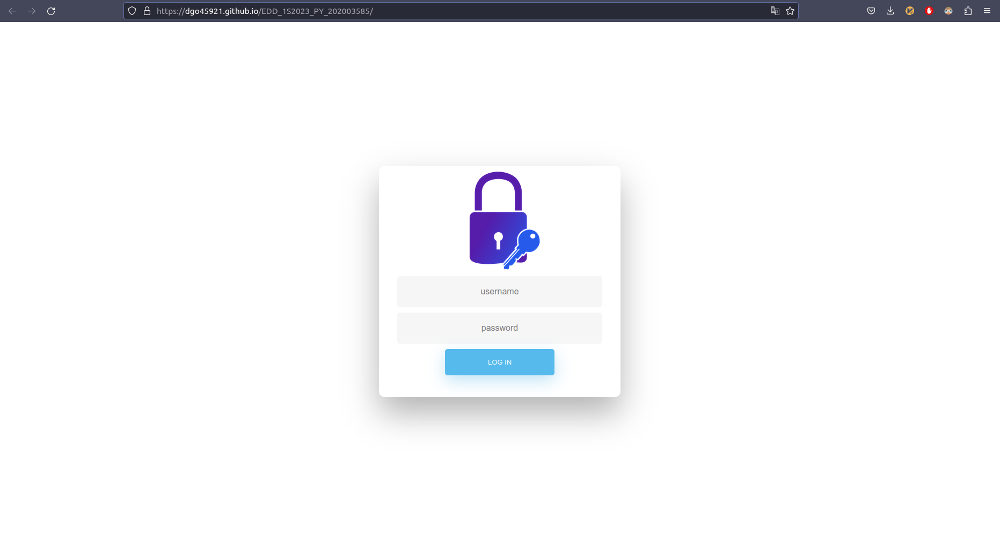

Al ingresar al enlace usted se encontrará con un formulario de inicio de sesión. Si usted ya está registrado por el administrador, puede ingresar su número de carnet y contraseña.  En caso de que usted no esté registrado, comuníquese con el adminsitrador para cargar sus credenciales al sistema.

### Módulo administrador

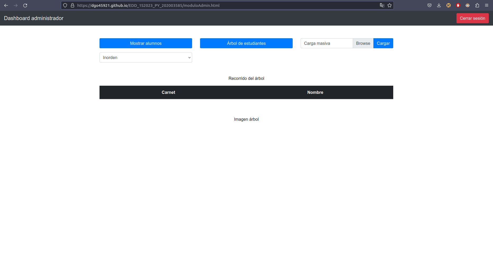

Cuando usted inicie sesión como administrador dispondrá de las siguientes opciones:

- Cargar estudiantes

- Mostrar árbol de estudiantes

- Mostrar tabla de estudiantes(inorden, preorden, postorden)

Para cargar a los estudiantes, usted debe disponer de un archivo .json  tenga la siguiente estructura:

```json5
{
 "alumnos": [
  {
   "carnet": 50,
   "nombre": "primero",
   "password": "xsax",
   "Carpeta_Raiz": "/"
  },
  {
   "carnet": 10,
   "nombre": "Diego",
   "password": "123",
   "Carpeta_Raiz": "/"
  },
  {
   "carnet": 60,
   "nombre": "carla",
   "password": "hola",
   "Carpeta_Raiz": "/"
  },
  {
   "carnet": 20,
   "nombre": "fabiana",
   "password": "zzz",
   "Carpeta_Raiz": "/"
  },
  {
   "carnet": 70    ,
   "nombre": "alexis",
   "password": "jaja",
   "Carpeta_Raiz": "/"
  },
  {
   "carnet": 30    ,
   "nombre": "lucia",
   "password": "jaja",
   "Carpeta_Raiz": "/"
  },
  {
   "carnet": 80    ,
   "nombre": "geo",
   "password": "jaja",
   "Carpeta_Raiz": "/"
  },
  {
   "carnet": 40    ,
   "nombre": "lucia",
   "password": "jaja",
   "Carpeta_Raiz": "/"
  },
  {
   "carnet": 90    ,
   "nombre": "Damian",
   "password": "jaja",
   "Carpeta_Raiz": "/"
  }
 ]
}
```

Una vez subido el archivo, usted puede presionar el botón "cargar", y si todo ha salido bien verá el siguiente mensaje:

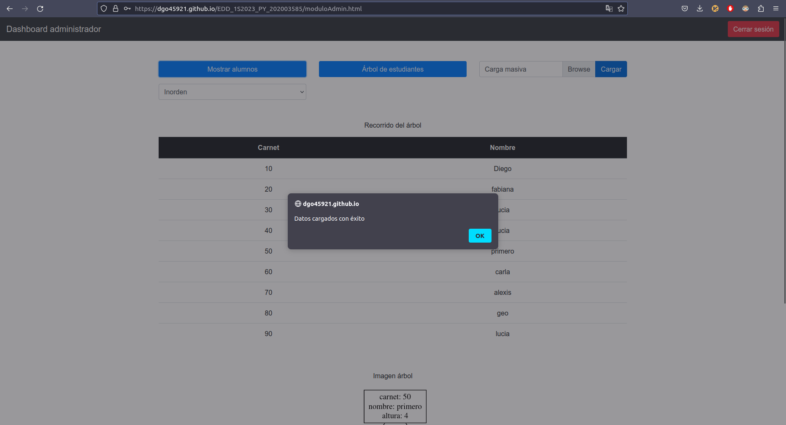

Luego de cargados los usuarios usted puede presionar el botón de árbol de estudiantes y la tabla de estudiantes se mostrará según el recorrido seleccionado en la lsita de opciones debajo del botón "Mostrar alumnos"

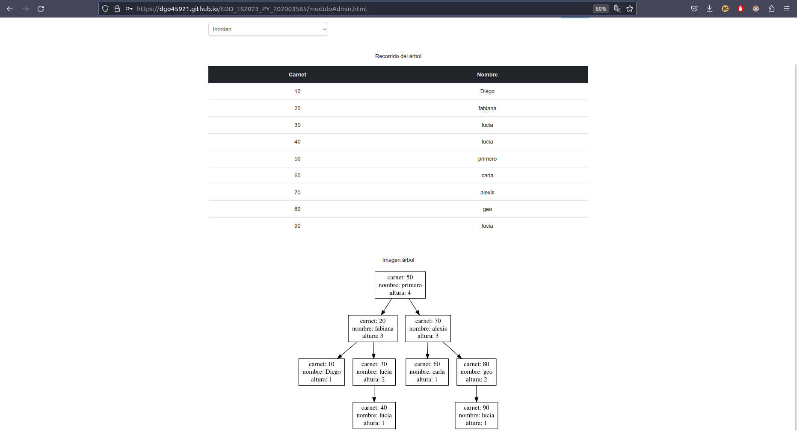

### Módulo de usuario

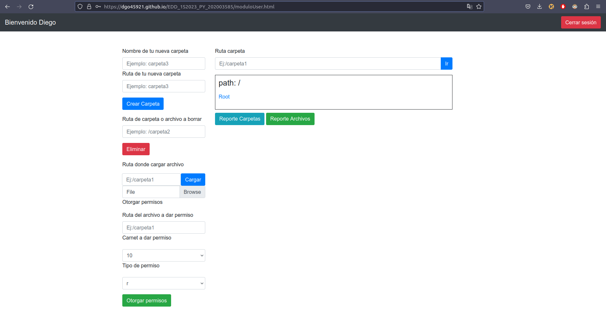

Cuando usted inicie sesión por primera vez eso será lo que usted verá. Cada usuario tiene asociada un directorio raíz "/" en la cual se podrán cargar carpetas y archivos. En el recuadro que se encuentra al medio, usted será capaz de visualizar sus archivos y carpetas de una manera gráfica.

- ###### Crear carpeta
  
  Cuando usted desee crear una carpeta debe de proporcionar un nombre y una ruta en donde será almacenada.

- ###### Eliminar directorio/archivo
  
  Para eliminar un archivo o carpeta usted debe de proporcionar la ruta exacta para que software pueda buscar el directorio o archivo y así eliminarlo. Cabe recalcar que si usted desea eliminar un archivo debe de incluir la extensión de este en la ruta a eliminar.

- ###### Cargar archivo (.png, .jpeg, .jpg, .pdf, .txt, .gif, .tiff)
  
  Si usted desea cargar un archivo debe de tener en cuenta que solo se aceptan las extensiones que están definidas arriba. Tenga en cuenta que el software no proporciona tanto espacio de almacenamiento ya que almacena la información dentro del navegador.

- ###### Otorgar permisos a demás usuarios (beta)
  
  Si usted quisiese otorgar permisos de escritura/lectura/ambos a un usuario en el sistema, usted tiene una lista con todos los carnets registrados en el sistema para poder asociar a este usuario el permiso. Debe de incluir la ruta exacta del archivo que desea compartir. Recuerde incluir la extensión.

- ###### ir
  
  Si el sistema de carpetas que tiene es demasiado complejo, usted puede dirigirse a la barra arriba de su cuadro de archivos e ingresar la ruta a la que desea ir.

- ###### Reporte carpetas
  
  Cuando usted presione ese botón aparecerá abajo una imágen de su sistema de carpetas actual.

- ###### Reporte archivos
  
  Cuando usted presione este botón será capaz de ver los archivos en el directorio que se encuentra actualmente y ver los permisos de cada archivo asociados con el carnet de otro usuario.

- ###### Bitácora
  
  Cada vez que usted realice una acción aparecerá abajo una lista de las acciones que usted realizó, esto para que usted tenga control de cada una de las acciones que realizo.

### Vista general del módulo

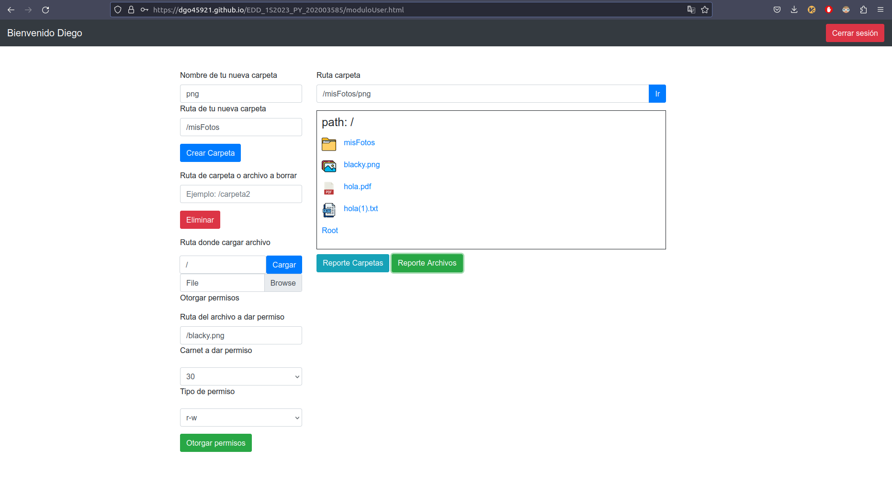

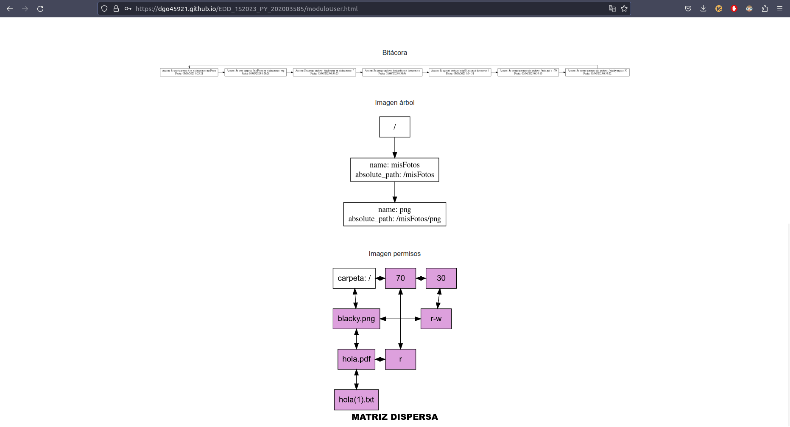

---

# Manual técnico

Bienvenido al manual técnico de la página: 

https://dgo45921.github.io/EDD_1S2023_PY_202003585/

Este sitio web le permite almacenar archivos y crear carpetas en un sitio web por medio de estructuras de datos.

###### Tecnologías utilizadas:

- Html

- Css

- Javascript

###### Estructura de la aplicación web

La aplicación web está conformada por un directorio raíz y tres directorios extra encargados el funcionamiento correcto de la aplicación.

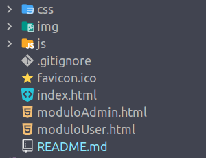

- css: Esta carpeta contiene un documento .css encargado de estilizar el index.html. Para la estilización de los otros dos html se hizo uso de bootstrap.

- js: Esta carpeta contiene todo el código javascript necesario para que la aplicación funcione. Acá se incluye el código respectivo para el módulo de administrador y usuario, así como también el código de las estructuras de datos que se usaron en la app.

- img: Esta carpeta contiene las imágenes para representar los íconos de los archivos del módulo de usuario. Contiene también las imágenes de este documento md.

###### Configuración del entorno de desarrollo

Para poder correr esta app hace falta lo siguiente:

- Requerimientos de software:
  
  - Navegador web
  
  - Servidor local o remoto

- Requerimientos de hardware:
  
  - Mouse
  
  - Teclado
  
  - Monitor

###### Lógica del programa

**Estructuras usadar para almacenar la información**

- Árbol AVL
  
  Contiene a cada uno de los estudiantes registrados en el sistema

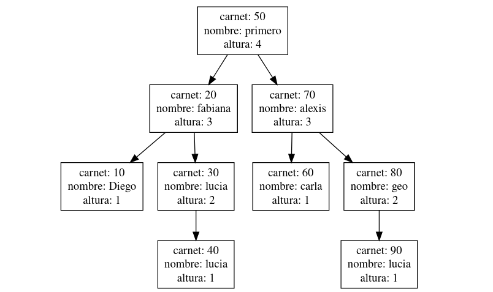

- Árbol n-ario
  
  Cada estudiante tiene uno y representa sus directorios. Cada uno de estos nodos contiene una matriz dispersa.
  
  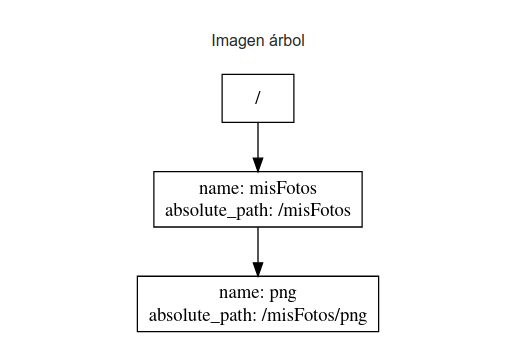

- Matriz dispersa: Esta matriz representa los archivos que están dentro de cada carpeta, las filas son los archivos, las columnas los carnets y los nodos interiores representan el tipo de permiso que tienen los carnets respecto al archivo.
  
  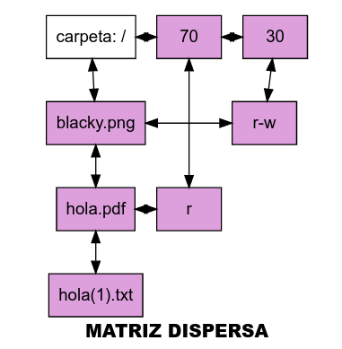

- Lista simplemente enlazada circular: Representa cada una de las acciones que el usuario logueada ha hecho.
  
  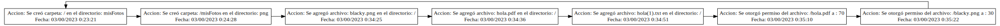

**Nota Para la persistencia de la información se hizo uso de localstorage**

**Diagrama UML del programa**

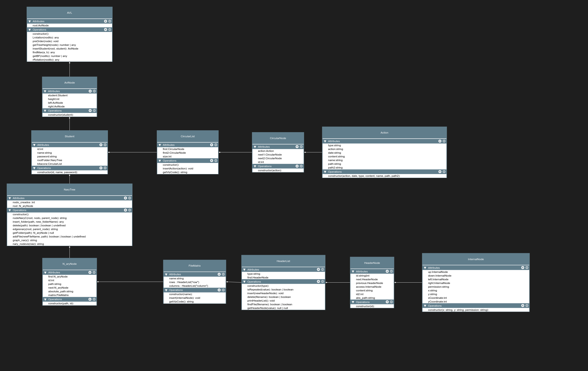

Como se aprecia en el diagrama la estructura de datos principal es un árbol AVL, el cual contiene en cada nodo a un estudiante, que a su vez contiene un árbol n-ario para el manejo de carpetas, y cada nodo del árbol n-ario contiene una matriz dispersa que representa permisos de archivos a los usuarios, siendo las filas los archivos en sí, y las columnas representan el carnet del usuario que tiene el permiso. Los nodos internos de la matriz representan el permiso en sí, los permisos disponibles son: r,w,r-w.

Cabe recalcar que los archivos que se comunican con todas las clases son:

- userModule.js

- adminModule.js

###### Funciones y métodos de clases

- **AVL** (almacena usuarios en árbol avl)
  
  - getTreeHeight(node): retorna la altura del árbol en base al nodo que le pasemos
  
  - findMax(a,b): retorna a o b dependiendo de cual sea más grande
  
  - rRotation(nodito): Hace una rotación hacia la derecha en base al nodo que sea pasado como argumento.
  
  - LRotation(nodito): Hace una rotación hacia la izquierda en base al nodo que sea pasado como argumento
  
  - getBF(nodito): Retorna el factor de balance del nodo que le sea pasado como argumento
  
  - insertStudent(root, student): inserta un estudiante en el nodo del árbol avl siguiendo las reglas del árbol y ejecutando sus respectivas rotaciones cada que se requiera.

- **NaryTree** (almacena carpetas del usuario logueado en árbol n-ario)
  
  - addFile(newFileName, path): Ingresa el nuevo nodo carpeta al árbol n-ario dependiendo de la ruta que sea pasada como argumento
  
  - getFolder(path): Retorna la carpeta correspondiente a la ruta que le sea pasada como argumento
  
  - delete(path): Elimina la carpeta correspondiente a la ruta pasada como argumento.
  
  - graph_nary(): Función que retorna código .dot correspondiente al árbol n-ario al que estemos  haciendo referencia.

- **FileMatrix** (almacena los permisos de los archivos en matriz dispersa)
  
  - insert(internalNode): se encarga de insertar un nodo interno de la matriz
  
  - getVIzCode(): Función que retorna el código .dot para graficar la matriz dispersa

- **HeaderList** (representa las filas y columnas de la matriz dispersa. Las filas guardan el archivo codificado en base64)
  
  - insert(newHeaderNode): se encarga de insertar un nodo cabecera a la matriz y de asignarle a cada uno un id.
  
  - getHeaderNode(value): retorna el nodo cabecera que tenga el mismo id que el argumento value.
  
  - FindFile(filename): verifica si un archivo ya está guardado en la lista cabecera.
  
  - delete(filename) elimina un archivo de la lista cabecera y consecuentemente desconecta todos los nodos internos que estaban relacionados con la fila.

- **CircularList**
  
  - insertAction(action): inserta una acción a la lista enlazada cirtular
  
  - getVizCode(): retorna el código .dot para representar a la bitácora de acciones del usuario actual.
